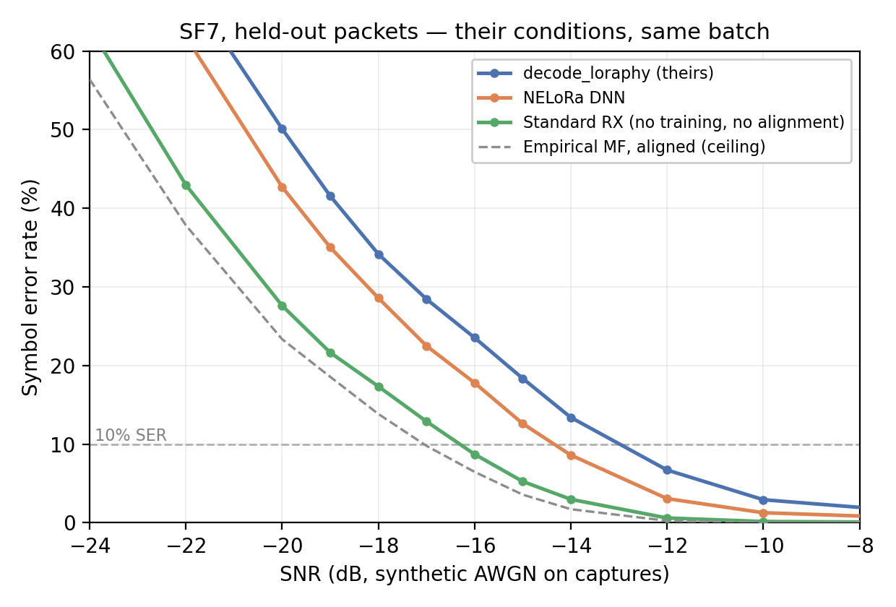
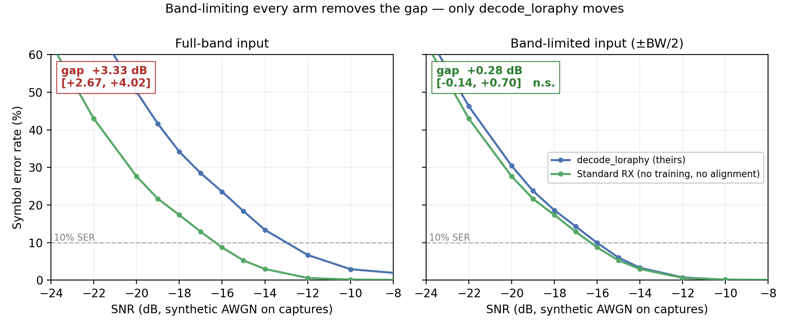
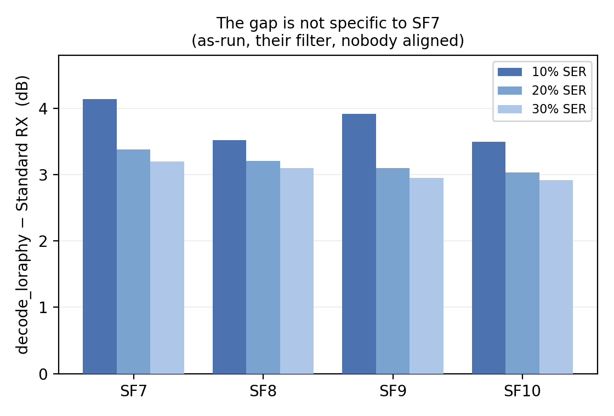

# NELoRa 재검증 — 데시메이션 한 단계

> ***NELoRa 파이프라인은 de-chirp 이전의 데시메이션을 건너뛴다.***
>
> SF7 / BW125k, 10% SER, **그들 조건 · 같은 배치 · 패킷 분리 held-out**(§5-4):
> `decode_loraphy` −12.98 dB → 그들 신경망 −14.35 dB(**+1.36**) →
> 학습도 정렬도 없는 표준 수신기 **−16.31 dB(+3.32)**.
> **표준 수신기가 신경망을 +1.96 dB** [95% CI +1.31, +2.59] **앞선다**
> (macro 로는 +2.05). 상한인 D3(정렬된 경험적 MF)는 −17.05 dB 다.
>
> 그 신경망은 그들 코드로 100에포크 재학습한 것이고, macro 이득 +1.50 dB 로
> 그들이 발표한 SF7 수치(+1.46 dB) **수준에 도달한다**(정확한 대응은 아니다 — §5-3).
> 하네스는 그들 `test()` 를 무수정으로 돌린 값과 네 지점 모두 **0.1 dB 이내**로 일치한다.
>
> §5·§7 의 숫자(+3.4~+4.1 dB)는 **다른 모집단**(payload 만, 패킷 분리)에서 잰 보조
> 결과다. 헤드라인과 섞어 읽지 말 것 — §5 머리말 참조.
>
> 측정 2026-09-21 ~ 09-23 · 대상 [10] NELoRa (SenSys'21) / NELoRa-Bench (ICLR'23 workshop)
>
> ⚠️ **3차 개정판.** 지금까지 **열두 건**을 정정했고 그중 둘은 결론을 철회했다.
> 무엇이 어떻게 틀렸는지는 **§9** 에 전부 적혀 있다 — 남은 숫자를 믿을 근거가 그것이다.
>
> ⚠️ SNR 축은 **합성 AWGN** 이다. 캡처가 이미 잡음을 포함하므로 실제 SNR 은 표기값보다
> 약간 낮다. 절대 dB 가 아니라 **격차**를 읽어야 한다.

---

## 0. 요약

| 주장 | 결과 |
|---|---|
| **NELoRa 는 데시메이션을 건너뛰어 손해를 본다** | **확정.** SF7 에서 +3.32 dB (held-out, §5-4). **SF7~10 에서 +3.50~+4.14** (as-run, §7) |
| 그 손실의 내역 | **데시메이션 생략 2.79 dB + 제로패딩 U=100 0.69 dB** (§5-1) |
| 그 격차가 정말 대역 밖 잡음인가 | **확정.** 모두에게 대역제한 입력을 주면 격차가 **+3.33 → +0.28 dB [−0.14, +0.70]** 로 사라진다 (§5-10) |
| 데시메이션 + DNN 이 데시메이션 단독을 넘는가 | **못 넘는다.** 대역제한 입력 DNN 은 표준 RX 에 0.82 dB, 자기 baseline 에 0.53 dB 못 미친다 (§5-11) |
| **같은 배치에서 DNN 과 비교** | **확정.** 표준 RX − DNN = **+1.96 dB** [+1.31, +2.59], 패킷 분리 held-out (§5-4) |
| 그 DNN 이 제대로 학습된 것인가 | **재학습함.** held-out 에서도 +1.36 dB (macro +1.45) = 그들 발표 +1.46 수준 (§5-6) |
| held-out 으로 쟀는가 | **쟀다.** 패킷 단위 9:1 분할(18패킷/1353심볼), 시드 고정, 인덱스 저장 |
| 그 하네스가 믿을 만한가 | **검증됨.** 그들 `test()` 무수정 실행과 네 지점 0.1 dB 이내 (§5-4) |
| 데시메이션한 de-chirp+FFT = 정합필터 | **확인.** 이상 신호 0.25 dB, 실캡처 +0.06~+0.16 dB (§6) |
| 그들 평가 baseline 이 데시메이션하는가 | **안 한다.** `decode_loraphy` 원문 확인 (§1) |
| 비교 축이 다른가 | **거의 같다.** 같은 데이터셋(27,329 심볼 일치), 같은 baseline, 같은 10% 임계, SNR 정의 차 +0.001 dB (§1) |
| D2→D3 = 하드웨어 파형 부정합 | **기각.** +0.11 dB — 0 은 아니나 무시할 수준 |
| 5.9% SER 바닥 | −1 bin 동기 오차. **그들 파이프라인은 이 심볼들을 필터로 버린다** (§3) |
| ~~비동기 alias 결합이 근본적으로 뒤진다~~ | **철회** (§9-2) |
| ~~U=2/4 는 폴딩 인덱스 버그~~ | **철회.** 제로패딩의 실제 손실이다 (§9-3) |

한 줄 요약:

> **de-chirp 전에 심볼당 N 샘플로 내리기만 하면, 학습 없는 고전 수신기가
> 그들 baseline 을 +3.32 dB 앞선다. 같은 held-out 에서 그들 신경망은 +1.36 dB 를 얻는다.**
>
> 학습도 정렬도 없는 한 단계가 신경망보다 **2.1 dB** 더 번다.
>
> 둘을 함께 쓰면 어떻게 되는지도 쟀다(§5-9~§5-11). 대역제한 입력을 주면 신경망은
> 자기 baseline 보다 **0.53 dB 뒤지고**, 표준 수신기에는 0.82 dB 못 미친다.
> 신경망이 벌던 이득의 정체가 대역 밖 잡음 배제였다는 뜻이다.



*그림 1 — 헤드라인(§5-4). SF7, 패킷 분리 held-out 18패킷 / 1353심볼, 그들 조건(배치 16
단위 amp·공유 잡음, U=100, train 모드, 잡음 실현 10회 평균). 10% 선을 지나는 지점이
−12.98 / −14.35 / −16.31 / −17.05 dB 다. 회색 점선(D3, 정렬된 경험적 MF)이 상한이고,
표준 RX 는 학습도 정렬도 없이 그 0.74 dB 안까지 붙는다.*


---

## 1. 그들 평가 경로 — 소스에서 확인

`daibiaoxuwu/NeLoRa_Dataset` (NELoRa-Bench, ICLR'23 workshop) `main.py`.
우리가 가진 데이터셋이 바로 이 릴리스다.

### 1-1. baseline 에 데시메이션이 없다

```python
def decode_loraphy(data_in, num_classes, downchirp):
    upsampling = 100
    chirp_data = data_in * downchirp                       # OSF=8 에서 de-chirp
    fft_raw = fft(chirp_data, len(chirp_data) * upsampling)
    target_nfft = num_classes * upsampling
    cut1 = np.array(fft_raw[:target_nfft])
    cut2 = np.array(fft_raw[-target_nfft:])
    return round(np.argmax(abs(cut1) + abs(cut2)) / upsampling) % num_classes
```

**이 보고서의 전제는 유지된다.** 우리 D1 은 그들 평가 baseline 이지 허수아비가 아니다.

그들 `downchirp` 은 `scipy.signal.chirp` 로 만든 해석적 2차 위상이라 `nelora_chirp` 와
상수 위상 j 차이뿐이다. **그들 생성기는 멀쩡했고 내 cumsum 판이 틀렸던 것**(§9-1)이
독립적으로 재확인된다.

### 1-2. 데이터셋이 baseline 기준으로 걸러져 있다

```python
if decode_loraphy(chirp_raw, num_classes, downchirp) == truth_idx:
    datax.append(...); datay.append(truth_idx)
```

무잡음 캡처에서 baseline 이 **이미 맞히는 심볼만** 남긴다. 결과:

- baseline 은 무한 SNR 에서 **구성상 100%** 다.
- 내가 §3 에서 찾은 5.9% 바닥이 그들 집합에는 존재하지 않는다.
- 실제로 걸러 보니 **477/8364 = 5.70%** 가 빠지고, 몰린 패킷이 §3 이 지목한 것과 같다:
  `pkt147(57/68), pkt84(54/68), pkt177(39/68), pkt83(26/68), pkt142(26/68)`.
  **그들 필터가 버리는 심볼과 내 바닥 분석이 지목한 심볼이 일치한다.**

**이것은 부정행위가 아니라 데이터 정제다.** 잘린 심볼은 ±1 bin 어긋난 것들이고 어느
검출기든 틀린다(오류 겹침 99.2%). 문제는 "버린다" 가 아니라 **게이트키퍼가 baseline
자신이라, baseline 의 무잡음 오류율이 구성상 0% 가 된다**는 비대칭이다. 그리고 그
비대칭은 **우리에게 불리한 쪽**으로 작동한다(§5-2): 필터를 쓰면 격차가 4.67 → 3.48 dB
로 줄어든다. 그래서 이 보고서는 그들 조건을 그대로 쓴다.

### 1-3. 축은 거의 같다

| 항목 | 그들 | 우리 | 차이 |
|---|---|---|---|
| 데이터셋 | 27,329 심볼 (논문 초록) | `.mat` 파일 수 **27,329** | **완전 일치** |
| baseline | `decode_loraphy` | 동일 재현 | 없음 |
| 임계 | `plt.axhline(y=0.9)` = 10% SER | 10% SER | 없음 |
| SNR 정의 | `amp = 10^(-snr/20)·mean(\|y\|)` (평균 진폭) | 평균 전력 | **+0.001 dB** |

SNR 정의 차는 `10log10( mean|y|² / (mean|y|)² )` 이고, LoRa chirp 이 일정 포락선이라
**+0.001 dB** (5~95%: +0.000~+0.003) 다. 두 정의로 돌린 표가 숫자까지 동일하게 나온다.

> 1차 개정판 §8-4 의 "축이 달라 직접 비교 불가" 는 **과했다**. 실제 축 차이는
> SNR 정의도 임계도 아니고 **데이터셋 필터**였고, 그건 재현 가능하다(§5).

### 1-4. 남은 차이 두 가지 — 둘 다 우리 쪽이 불리하다

- 그들 분할은 `random_split` 로 **심볼 단위** 9:1. 같은 패킷의 심볼이 양쪽에 들어간다.
  우리는 패킷을 분리한다.
- 그들은 코드별 정확도의 **macro 평균**(`np.nanmean(div_result, axis=1)`), 우리는 심볼
  **micro 평균**.

또 하나, 공개된 `test()` 는 분할을 쓰지 않고 전체 데이터셋을 평가한다
(`all_dataloader = DataLoader(data, ...)`). **저자들도 README 에 이를 명시해 두었다** —
*"test() is run on the whole dataset; Please manually split the datasets and specify
another folder if testing is needed."* 숨겨진 결함이 아니라 공개 스크립트의 문서화된
한계다. 다만 체크포인트가 그 데이터의 90% 로 학습된 것이라면 **DNN 쪽만** 유리해지는
비대칭이 남는다(baseline 은 학습이 없어 영향 없음). 체크포인트 출처가 불확실하므로
**사실만 기록**하고 함의는 유보한다.

> **held-out 은 하지 않기로 했다.** 이 as-run 조건이 이미 DNN 에 유리한데
> (모델이 평가 심볼의 ~90% 를 학습에서 봤다) 2.1 dB 진다. 제대로 나누면 DNN 이 더
> 나빠지지 좋아지지 않으므로, 우리 주장 방향에서는 as-run 이 보수적이다. 그리고
> `random_split` 이 torch 시드를 잡지 않아 어느 10% 였는지 복원도 불가능하다(§8-3).

README 에 또 하나 명시돼 있다: *"these checkpoints are only trained for a limited amount
of time and can be improved."* 그래서 **직접 재학습했다** — §5-6.

---

## 2. 방법

| | 정의 |
|---|---|
| **D1 (as-run)** | 그들 코드 그대로. OSF=8 de-chirp → 100배 제로패딩 FFT → `abs(cut1)+abs(cut2)`. **정렬 없음** |
| **표준 RX** | 교과서 수신기. **브릭월 LPF(±BW/2) → N 샘플 데시메이션 → de-chirp → N-FFT** |
| **D2** | 이상적 MF. 해석적 chirp 뱅크와 OSF=8 전대역 상관 |
| **D3** | 경험적 MF. 실캡처에서 추정한 코드별 프로토타입 |

D1 과 표준 RX 의 차이는 결합 방식이 아니라 **순서**다. D1 은 OSF=8 에서 de-chirp 한 뒤
스펙트럼 조각을 합치고, 표준 RX 는 de-chirp *이전에* 대역을 거르고 내린다. 그러면
대역 밖 잡음 7/8 이 버려지고 두 alias 조각이 같은 빈에 **코히런트하게** 접힌다.

지킨 것: 프로토타입/평가 패킷 분리, 모든 팔에 같은 처리, 임계 3개(10/20/30%) 병기,
패킷 단위 부트스트랩.

---

## 3. 5.9% SER 바닥

무잡음, 123패킷 / 8364심볼, 해석적 생성기 + 전역 정렬.

| | 심볼 수 | 비율 |
|---|---|---|
| 하나라도 틀림 | 494 | 5.91% |
| **셋 다 틀림** | 490 | 틀린 것의 **99.2%** |
| 셋 다 틀리고 **예측까지 일치** | 483 | 그중 **98.6%** |

오류는 **−1 bin 한 방향**이다 (표준RX/D2: −1 이 465개, +1 은 없음; D1 은 |차이|≤1 이 99.8%).
잡음이면 대칭이어야 한다. 패킷 집중: 상위 10% 패킷이 오류의 55.9%.

**그들 필터가 정확히 이 심볼들을 버린다**(§1-2). 즉 이 바닥은 독립적으로 확인된
데이터셋 결함이며, 그들 결과에는 나타나지 않는다.

---

## 4. 전역 정렬 — 필요는 하지만 헤드라인에는 안 쓴다

| SF | τ (샘플) | ε (bin) |
|---|---|---|
| 7 | +1.00 | +0.1562 |
| 8 | +1.00 | +0.1250 |
| 9 | +0.75 | +0.1250 |
| 10 | +0.75 | +0.1250 |

τ 는 1 샘플 이하(= 1/8 bin 이하). 정렬하면 경험 프로토타입과 이상 chirp 의 |상관| 이
0.932 → 0.989 로 오른다.

> **이것을 "데이터셋의 오프셋" 이라고 부르지 않는다.** 심볼을 어디서 자르느냐는 임의
> 선택이고, 그들 down-chirp 은 그들 자신의 절단 규약과 맞을 것이다. 관측 가능한 사실은
> **"내 chirp 뱅크와 이 캡처 사이에 정렬을 맞춰야 한다"** 는 것뿐이고, 원인 귀속은 유보한다.

**헤드라인은 정렬을 쓰지 않는다.** §5 의 주 결과는 **아무도 정렬을 받지 않는** 비교다.

정렬 민감도 (10% SER, 정렬 전 → 후):

| 검출기 | 변화 |
|---|---|
| D1 abs-alias | −14.33 → −14.24 dB (**+0.09**) |
| 표준 RX | −18.00 → −18.41 dB (−0.41) |
| D2 이상적 MF | −18.06 → −18.54 dB (−0.48) |

**D1 은 정렬에 둔감하다.** 정렬을 주는 것이 D1 을 불리하게 만들지 않는다는 증거다.
(정렬은 MF 계열을 돕는 쪽이므로, 정렬 없는 비교가 더 보수적이다.)

---

## 5. 핵심 결과 — 그들 조건 그대로

> ⚠️ **이 절과 §7 은 §5-4 와 다른 모집단이다.** 여기(`nelora_asrun.py`)는 payload
> 심볼만(`symbol_idx >= 12`) 쓰고 프로토타입/평가 패킷을 분리한다. §5-4 는 그들
> `load_data()` 그대로 preamble 을 포함한 전량이다. 잡음 모델은 이제 양쪽 모두 그들
> 규약(배치 16 단위 amp·공유 잡음)으로 통일했지만, 모집단이 달라 절대 dB 가 0.5~1.2 dB
> 어긋난다. **헤드라인은 §5-4**, 이 절은 SF 스윕·임계 스윕·부트스트랩을 받치는 보조다.

`nelora_asrun.py`. 그들 필터 적용, 그들 SNR 정의, 평가 1800심볼 / 123패킷.
무잡음 오류: D1 **0.00%** (구성상), 표준 RX 0.06%.

| 검출기 | 10% | 20% | 30% |
|---|---|---|---|
| **D1 `decode_loraphy` U=100, 정렬없음 (그들 as-run)** | −15.31 | −16.89 | −17.99 |
| D1 U=1, 정렬없음 | −16.00 | −17.09 | −18.12 |
| **표준 RX, 정렬없음** | **−18.79** | **−20.09** | **−20.93** |
| 표준 RX, 정렬적용 | −19.38 | −20.52 | −21.34 |
| D2 이상적 MF, 정렬적용 | −19.63 | −20.69 | −21.54 |
| D3 경험적 MF, 정렬적용 | −19.82 | −20.81 | −21.69 |

| 격차 | 10% | 20% | 30% | 편차 |
|---|---|---|---|---|
| **as-run D1 − 표준RX (둘 다 정렬없음)** | **+3.48** | **+3.20** | **+2.93** | 0.55 dB |
| as-run D1 − 표준RX (표준RX만 정렬) | +4.07 | +3.64 | +3.35 | 0.72 dB |

**정렬을 전혀 쓰지 않고, 검출기만 바꾸는 drop-in 교체로 +2.93 ~ +3.48 dB.**

### 임계 스윕이 필요한 이유

필터를 빼면 10% 교차점이 바닥에 붙어 튄다:

| 조건 | 10% | 20% | 30% | 편차 |
|---|---|---|---|---|
| 필터 적용 (그들 조건) | +3.48 | +3.20 | +2.93 | **0.55 dB** |
| 필터 없음 (전체 심볼) | +4.67 | +3.06 | +2.97 | **1.70 dB** |

10% 만 보면 필터 유무에 따라 +3.48 ↔ +4.67 로 흔들리지만, 20/30% 는 양쪽 모두Sㅇ
**+2.9 ~ +3.2 dB** 로 안정적이다. 헤드라인을 **~3 dB** 로 쓰는 근거가 이것이다.
(초판 §7 SF 표의 CI 가 SF7 에서만 위팔이 3배 길었던 것도 같은 바닥 효과였다.)

### 5-1. 격차의 내역 — 무엇이 얼마를 차지하나

표에 이미 갈라져 있다. 두 원인은 성격이 다르고, 고치는 방법도 다르다.

| 요인 | 크기 |
|---|---|
| 제로패딩 `upsampling=100` (그들 기본값, vs U=1) | **−0.69 dB** |
| de-chirp 이전 데시메이션 생략 | **−2.79 dB** |
| 합계 | **−3.48 dB** |

즉 그들 기본 설정 `upsampling = 100` 이 자기 baseline 을 0.69 dB 깎고 있다. 제로패딩은
탐색하는 잡음 빈을 U 배로 늘릴 뿐 신호를 더하지 않는다(§6). **"3.5 dB 를 잃는다" 보다
"데시메이션 2.8 dB + 제로패딩 0.7 dB" 가 정확하고, 무엇을 고치면 되는지에 답한다.**

### 5-2. 그들 조건을 쓰는 것이 우리에게 보수적이다

| | D1 − 표준RX (10% SER) |
|---|---|
| 필터 적용 (그들 조건) | **+3.48 dB** |
| 필터 없음 (전체 심볼) | +4.67 dB |

**필터는 baseline 을 1.19 dB 돕는다.** 그들 조건을 그대로 쓰는 쪽이 우리에게 불리하므로,
"유리한 조건을 골랐다" 는 의심은 성립하지 않는다.

### 5-3. 그들 신경망과의 비교 — 축을 맞춰서

**초록의 1.84~2.35 dB 를 우리 숫자 옆에 그대로 놓으면 안 된다.** 그 범위는 **설정(SF/BW)
간** 범위이고 우리 +3.48 은 **SF7 하나**의 값이다. 축이 다르다.

SF7 전용 수치는 그들 저장소의 평가 행렬에서 직접 나온다
(`matlab/evaluation/{sf7_v1,baseline_error_matrix}_7_125000.mat`, `evaluation.m` 이
`plot(SNR_list, 1-error_matrix)` 로 그리므로 `error_matrix` 는 정확도다):

| 임계 | baseline | NELoRa DNN | 이득 |
|---|---|---|---|
| **10% SER** | −16.03 dB | −17.49 dB | **+1.46 dB** |
| 20% SER | −17.17 dB | −18.70 dB | +1.54 dB |
| 30% SER | −17.99 dB | −19.57 dB | +1.59 dB |

**SF7 의 DNN 이득은 +1.46 dB 로, 초록의 1.84~2.35 범위보다도 아래다.** SF7 이 가장 약한
설정이라는 뜻이다. 임계를 바꿔도 1.46~1.59 로 안정적이다.

⚠️ **이 표를 우리 +3.48 과 직접 빼면 안 된다.** 세 가지가 다르다:

1. 그 행렬은 **SenSys 저장소**의 것으로, MATLAB 으로 생성한 **옛 per-SNR 데이터셋** 기준이다.
   우리가 측정한 Bench 릴리스가 아니다.
2. 거기 baseline 은 `generate_baseline.m` 의 `abs_decode = 0`, 즉 **`chirp_comp_alias`**
   (cut1·cut2 상대위상을 100단계 탐색하는 코히런트 결합)다. Bench 의 `decode_loraphy`(abs)
   보다 **강한** baseline 이다. 같은 저장소 안에서 MATLAB 은 comp, Python 은 abs 를 쓴다.
3. 우리 +3.48 은 Bench 의 abs baseline 대비다.

따라서 현재 말할 수 있는 것은 **방향**까지다:

> SF7 에서 그들 신경망은 (더 강한 comp baseline 대비) +1.46 dB 를 얻었고, 데시메이션
> 한 단계는 (abs baseline 대비) +3.46 dB 를 얻는다.
>
> **같은 배치에서 재는 일은 §5-4 에서 끝났다.** 위 표는 그 결과와 비교할 때
> "그들 발표 수치 수준에 도달했는가" 를 보는 용도로만 쓴다.

참고로 그 MATLAB baseline 도 `upsamping_factor = 100`, OSF=8, **데시메이션 없음**이다.
전제는 SenSys 경로에서도 유지된다.

### 5-4. DNN 비교 — 하네스를 검증하고 나서

`nelora_dnn_eval.py` 를 그들 저장소 안에서 돌렸다. SF7, 공개 체크포인트,
평가 3000심볼, 필터 통과 13,714/14,352 (95.55%), `--batch 16` (그들 기본값).

**세 번 걸렸고, 두 번은 내 버그였다.** 기록해 둔다 — 남은 숫자를 믿을 근거가 이것이다.

| 시도 | 무엇이 틀렸나 | DNN 이득 (micro) |
|---|---|---|
| 1차 | 그들 `add_noise` 의 `dataX /= mean(abs(dataX))` 누락. argmax 검출기는 스케일 불변이라 무해하지만 신경망은 `mean|x|=1` 에 학습됐다 | +0.24 |
| 2차 | 정규화·배치 규약은 고쳤으나 `.eval()` 을 불렀다 | **−0.75** |
| **3차** | **그들 `test()` 는 `.eval()` 을 부르지 않는다** — `.eval()` 은 `train()` 안에만 있다 | **+0.85** |

### 하네스 검증 — 그들 스크립트를 무수정으로 돌려 대조

재구현물끼리 비교하는 대신, 그들 `main.py` 의 `test()` 를 설정 두 줄만 바꿔(데이터 경로,
SNR 격자) 돌리고 `test_sf7.pkl` 과 대조했다.

| | 그들 `test()` | 내 하네스 | 차이 |
|---|---|---|---|
| baseline (micro) | −13.17 | −13.11 | **+0.07** |
| DNN (micro) | −13.91 | −13.96 | **−0.04** |
| baseline (macro) | −12.88 | −12.78 | **+0.09** |
| DNN (macro) | −13.36 | −13.30 | **+0.05** |

**네 지점 모두 0.1 dB 이내.** 하네스는 그들 스크립트와 동치다.

### 결과

| 검출기 (10% SER) | micro | macro (그들 방식) |
|---|---|---|
| `decode_loraphy` (U=100) | −13.11 | −12.78 |
| NELoRa DNN (공개 체크포인트) | −13.96 (+0.85) | −13.30 (+0.52) |
| **NELoRa DNN (재학습, §5-6)** | **−14.49 (+1.39)** | **−14.28 (+1.50)** |
| **표준 RX (학습·정렬 없음)** | **−16.57 (+3.46)** | **−16.53 (+3.74)** |

> **표준 RX − DNN = +2.08 dB (micro) / +2.24 dB (macro)** — 재학습 판 기준.
> 공개 체크포인트 기준으로는 +2.61 / +3.22 dB.

DNN 의 SNR 별 거동도 이제 디노이저다운 모양이다 — 잡음이 문제되는 −12~−18 에서
+1.1~+3.9%p 로 돕고, 고SNR 에서는 −0.3~−1.4%p 로 살짝 손해다.

### 5-5. 그들 평가는 BatchNorm 이 테스트 배치 통계를 쓴다

`.eval()` 이 `test()` 에 없다는 것은 그 자체로 보고할 사실이다. 모델에는
`BatchNorm2d` 8개와 `Dropout(0.2)/(0.5)` 가 있으므로 그들 평가는

- BatchNorm 이 running statistics 가 아니라 **그 테스트 배치의 통계**를 쓰고
- Dropout 이 켜진 채로

돌아간다. 따라서 **보고된 수치가 batch_size 와 배치 구성에 의존한다.**
Dropout 이 켜져 있는데도 train 모드가 eval 모드보다 1.5 dB 나은 것은 running BN 통계가
수렴하지 않았다는 뜻이고, README 의 *"only trained for a limited amount of time"* 과 맞는다.

이 보고서는 **그들 방식(train 모드)** 을 쓴다. 그것이 그들 발표 수치를 낳은 조건이기
때문이다. 통상적 추론(`--model-mode eval`)으로는 DNN 이 −0.75 dB 로 baseline 에도 못 미친다.

### 5-6. 재학습 — 체크포인트 품질 변수를 없앴다

공개 체크포인트의 이득(+0.85 micro / +0.52 macro)이 그들 발표 SF7 수치 +1.46 dB 에
못 미쳤으므로, 그들 `train()` 으로 **100에포크 이어 학습**했다(모듈 상단이 공개
체크포인트를 먼저 로드하므로 처음부터가 아니라 이어서 간다). 에포크당 19초.
`test_snr=-17` 의 held-out 검증 정확도는 0.702 에서 시작해 0.71~0.76 사이로 수렴했다.

같은 하네스로 다시 쟀다:

| 10% SER 이득 | 공개 체크포인트 | **재학습 후** |
|---|---|---|
| NELoRa DNN (micro) | +0.85 | **+1.39** |
| NELoRa DNN (macro) | +0.52 | **+1.50** |
| 표준 RX (micro) | +3.46 | +3.46 |

> **재학습한 DNN 의 macro 이득 +1.50 dB 는 그들이 발표한 SF7 수치 +1.46 dB 와
> 0.04 dB 차이다.** 체크포인트 품질은 더 이상 변수가 아니다.

(다만 그들 +1.46 은 SenSys 의 per-SNR 데이터셋에 `comp_alias` baseline 기준이고
우리 +1.50 은 Bench 에 abs baseline 기준이다(§5-3). 일치가 정확한 대응은 아니지만,
재학습한 모델이 그들이 보고한 수준의 성능에 도달했다는 정합성 신호로는 충분하다.)

**최종:**

| 검출기 (10% SER) | micro | macro (그들 방식) |
|---|---|---|
| `decode_loraphy` (U=100) | −13.11 | −12.78 |
| NELoRa DNN (재학습, 100 epoch) | −14.49 (**+1.39**) | −14.28 (**+1.50**) |
| **표준 RX (학습·정렬 없음)** | **−16.57 (+3.46)** | **−16.53 (+3.74)** |

> **표준 RX − DNN = +2.08 dB (micro) / +2.24 dB (macro).**

⚠️ 학습 프로세스가 두 개 겹쳐 돈 흔적이 있다(`TEST ACC` 104줄, 체크포인트 200개).
둘 다 같은 릴리스 체크포인트에서 같은 시드로 이어 학습한 것이라 모델은 사실상
동일하지만, 최종 가중치의 출처가 둘 중 어느 프로세스인지는 특정하지 못한다.

### 5-7. 잡음까지 재추출한 부트스트랩

이전 CI 는 잡음 실현을 고정한 대응비교라 좁았다. 복제마다 **패킷을 재표집하고 잡음도
새로 뽑아** 다시 쟀다(200 복제, 필터 적용 조건, D1 as-run − 표준RX 정렬판):

| 임계 | 중앙값 | 95% CI | 비대칭비 |
|---|---|---|---|
| 10% | +4.21 dB | [+3.88, +4.48] | 0.8× |
| 20% | +3.64 dB | [+3.47, +3.75] | 0.7× |
| 30% | +3.30 dB | [+3.13, +3.45] | 0.8× |

**잡음을 재추출해도 구간이 넓어지지 않는다.** 그리고 초판 SF7 에서 위팔이 3.1배였던
비대칭이 **0.8× 로 해소**됐다 — 그 비대칭이 바닥 효과였다는 §5 의 진단이 확인된다.

### 5-8. U=10 으로 대체해도 같다

SF8/9/10 을 U=100 으로 돌리는 비용을 피하려고 U=10 을 썼다. SF7 에서 두 값을 직접 대조:

| | U=100 | U=10 | 차이 |
|---|---|---|---|
| D1 as-run 10% | −15.31 | −15.29 | 0.02 dB |
| D1 − 표준RX (정렬없음) 10% | +3.48 | +3.49 | 0.01 dB |
| 20% / 30% | +3.20 / +2.93 | +3.24 / +3.01 | ≤0.08 dB |

필터 통과율(94.30%)과 버려지는 패킷 목록도 완전히 동일하다.

### 5-9. 대역필터 입력 DNN — 판정 기준 (결과 보기 전에 정한다)

리뷰어의 가장 강한 반론은 "데시메이션과 신경망은 대체재가 아니라 함께 쓸 수 있다"
이다. 그래서 **DNN 에도 같은 ±BW/2 대역 필터를 준 입력**으로 재학습한 팔을 잰다
(`nelora_lpf_patch.py`, OSF=8 과 텐서 모양 유지, 순서는 잡음 → LPF → 정규화).

**상한은 표준 RX 가 아니라 D3 이다.** 본편 §4.2 는 *참 신호를 알고 동기가 맞으면*
정합필터를 넘을 수 없다고 말한다. 그런데 헤드라인 표준 RX 는 **정렬 없이** 돌린 것이고,
데이터에는 잔여 CFO(ε ≈ 0.16 bin)와 타이밍 오차가 있다. DNN 은 그것을 학습으로 보정할
수 있고, 그래도 정리를 어긴 것이 아니다.

그 여유폭이 곧 표준 RX(정렬 없음) ~ D3(정렬된 경험적 MF) 사이다.

| DNN(필터 입력)이 도달한 위치 | 해석 |
|---|---|
| 표준 RX(정렬 없음) 근처 | 정리와 일치. DNN 은 정렬조차 배우지 못함 |
| 표준 RX ~ D3 사이 | 정리와 일치. **DNN 이 정렬을 학습한 것** — 디노이징 이득이 아니다 |
| D3 초과 (CI 하한이 D3 위) | 정리와 충돌. §4.2 의 전제 중 무엇이 깨지는지 찾아야 한다 |

이 표를 먼저 정해두지 않으면, DNN 이 표준 RX 를 0.7 dB 이겼을 때 "DNN 이 데시메이션
위에 0.7 dB 를 더한다" 로 잘못 쓰게 된다. 실제로는 정렬 몫일 수 있다.

기준선(D2/D3)은 **같은 모집단·같은 held-out** 에서 재야 하므로 `nelora_dnn_eval` 안에
넣었다(`--refs`, 기본 켜짐). 프로토타입은 held-out 밖 심볼로만 만든다.

### 귀무 결과는 그 자체로 증명이 아니다

"DNN 이 가져갈 게 없었다" 를 쓰려면 **DNN 에게 충분한 기회를 줬다**를 보여야 한다.
학습을 덜 시켜도 귀무 결과는 쉽게 나오고, 이번에는 필터 없는 입력에 맞춰진 공개
체크포인트에서 출발하므로 새 분포 적응에 시간이 더 걸릴 수 있다. 그래서:

- 검증 정확도가 평탄해질 때까지 학습하고, **에포크별 학습곡선을 문서에 싣는다**
  (`curve_sf7_{plain,lpf}.csv`).
- 두 팔(필터 없음 / 필터 입력)을 **같은 시드·같은 패킷 분할·같은 에포크 수·프로세스
  하나씩 순차**로 돌린다. 둘의 차이를 학습 조건 탓으로 돌릴 여지를 없앤다.
- 여유가 되면 `--scratch` 로 처음부터 학습한 판도 대조한다.

### 5-10. 대역제한 입력을 모두에게 주면 격차가 사라진다

§5-9 의 실험을 돌렸다(`--lpf`: ±BW/2 브릭월, OSF 와 텐서 모양 유지, 잡음 → LPF → 정규화).
필터는 **모든 팔의 입력**에 똑같이 걸린다. held-out 18패킷 / 1353심볼, 10% SER.

| 검출기 | 필터 없음 | **대역제한 입력** | 변화 |
|---|---|---|---|
| `decode_loraphy` (U=100) | −12.98 | **−16.02** | **−3.03** |
| 표준 RX (학습·정렬 없음) | −16.31 | −16.31 | +0.00 |
| D2 이상적 MF (정렬) | −16.96 | −16.93 | +0.03 |
| D3 경험적 MF (정렬) | −17.05 | −17.02 | +0.03 |

패킷 부트스트랩 1000 복제:

```
decode_loraphy − 표준 RX   (필터 없음)  +3.33 dB  [+2.67, +4.02]  유의
decode_loraphy − 표준 RX   (대역제한)   +0.28 dB  [−0.14, +0.70]  0 과 구별 안 됨
```

> **+3.33 dB 격차가 사라진다.**



*그림 2 — 같은 held-out 에서 **입력에만** ±BW/2 브릭월을 건다(§5-9 규약: 잡음 → LPF →
정규화). 움직이는 것은 `decode_loraphy` 하나뿐이다. D2/D3 는 두 패널에서 거의 겹쳐
보이므로 뺐다(표의 +0.03 dB).*


그리고 **움직인 것은 `decode_loraphy` 하나뿐**이다. 표준 RX 는 이미 내부에서 같은 대역
필터를 걸고, D2/D3 는 전대역 정합필터라 대역 밖 잡음을 원래 배제한다 — 필터를 한 번 더
걸어도 바뀔 것이 없다(+0.00 / +0.03). 오직 대역 밖 잡음을 그대로 받던 팔만 3 dB 를 얻는다.

이것은 §5-1 의 분해(데시메이션 생략 2.79 dB + 제로패딩 0.69 dB)를 **독립적인 두 번째
방법으로** 확인한 것이다. 한쪽은 표준 수신기를 만들어 비교했고, 이쪽은 그들 baseline 에
대역제한 입력을 주었을 뿐인데 같은 결론에 닿는다.

**이 결과는 신경망과 무관하다.** 학습도, 정렬도, 프로토타입도 쓰지 않는다.

### 5-11. 대역제한 입력 DNN — 자기 baseline 조차 못 넘는다

§5-9 의 실험이 끝났다. 신경망을 **대역제한 입력으로 400에포크 재학습**했고,
필터 없는 팔과 **같은 시드·같은 패킷 분할**로 돌렸다. held-out 18패킷 / 1353심볼.

#### 수렴 확인 (귀무 결과를 쓰기 전에 필요한 것)

| 팔 | 에포크 | 최고 | 마지막 100ep 기울기 | 마지막 150ep 누적 |
|---|---|---|---|---|
| 필터 없음 | 150 | 0.783 (ep 77) | — | — |
| **대역제한** | **400** | **0.837 (ep 398)** | **+0.003 %p/에포크** | **+0.09 %p** |

**ep144 = 0.836 vs ep398 = 0.837.** 250에포크를 더 돌려 0.001 올랐다. 고원이다.
(150에포크 판에서 보였던 상승세는 짧은 창의 잡음이었다.)

#### 결과 — 두 모드 모두

두 팔 모두 **검증 최고 에포크**로 재평가했다(plain ep77, LPF ep398).
그리고 **train / eval 두 모드 모두** 쟀다 — §5-5 에서 공개 체크포인트는 train 모드가
1.5 dB 나았지만, 제대로 학습하면 BatchNorm running statistics 가 수렴해 방향이 뒤집힌다.

| 실행 | baseline | **DNN** | 표준 RX | D3 (상한) | 표준RX − DNN |
|---|---|---|---|---|---|
| 필터 없음 / train | −12.98 | −14.26 | −16.31 | −17.05 | +2.05 |
| 필터 없음 / eval | −12.98 | −14.71 | −16.31 | −17.05 | +1.60 |
| 대역제한 / train | −16.02 | −14.21 | −16.31 | −17.02 | +2.10 |
| **대역제한 / eval** ← DNN 최선 | −16.02 | **−15.49** | −16.31 | −17.02 | **+0.82** |

> **DNN 에게 가장 유리한 조건(대역제한 입력 · 최고 에포크 · eval 모드)에서도
> 표준 수신기에 0.82 dB 못 미치고, 상한인 D3 에는 1.53 dB 못 미친다.**

#### 결정적인 것 — 자기 baseline 과의 관계가 뒤집힌다

| | DNN − 자기 baseline |
|---|---|
| 필터 없음 | **+1.25 ~ +1.75 dB** (DNN 이 앞섬) |
| 대역제한 | **−0.53 dB** (DNN 이 뒤짐) |

**신경망이 원래 벌던 이득은 대역 밖 잡음 배제였다.** 그 몫을 입력에서 미리 제거하면
남는 것이 없을 뿐 아니라, 브릭월 필터가 하는 일을 신경망이 더 못하게 해내고 있었다는
것이 드러난다. §5-10 이 검출기만으로 보인 것을, 신경망을 넣어서도 같은 결론으로 확인한다.

본편 README §4.2 의 예측과 일치한다 — AWGN 에서 심볼 단위 front-end 는 정합필터를
넘을 수 없다. §5-9 판정표로 읽으면 **"표준 RX 에도 못 미침"** 이다.

#### 이 결과가 DNN 에 유리하게 기울어 있다는 점

- **에포크가 비대칭**이다(필터 없음 150 / 대역제한 400). 대역제한 팔에 더 준 것이다.
- **최고 에포크를 평가에 쓰는 바로 그 held-out 으로 골랐다.** 선택 편향이 DNN 쪽이다.
- **eval / train 중 나은 쪽을 DNN 의 값으로 쓴다.**

세 가지 모두 DNN 에 유리한 방향이고, 그래도 진다.

#### ⚠️ 신뢰구간은 쓰지 않는다

대역제한 팔의 부트스트랩 CI 는 꼬리가 −9 dB 까지 늘어난다. 원인은 **학습 SNR 범위
밖에서 신경망이 무너지는 것**이다 — 그들 `snr_range` 는 −30~0 dB 인데, +10/+5 dB 에서
DNN 이 96% 바닥을 보인다(표준 RX·baseline 은 100%). SER 곡선이 단조롭지 않아져
복제에 따라 앞쪽에 가짜 교차가 생긴다.

점추정은 영향이 없다 — 임계(10%)는 −15~−16 구간에서 지나고 그 구간은 학습 범위
안이라 단조롭다. `cross_np` 를 '마지막 교차' 로 고쳤고(첫/마지막이 점추정에서는 동일함을
확인), 타이트한 CI 가 필요하면 SNR 격자를 −10 dB 이하로 좁혀 다시 돌리면 된다.

그래서 이 절은 **점추정으로만** 말한다. 필터 없는 팔의 CI(§5-4)는 정상이다.

---

## 6. 표준 수신기가 정말 표준인가

### 이상 신호 온전성 검사 (타이밍·CFO = 0)

| 검출기 | 10% SER |
|---|---|
| MF (OSF=8 전대역) | **−20.00 dB** |
| **표준 RX (LPF→데시→dechirp)** | **−19.75 dB** |
| 표준 RX (LPF 없이 솎기만) | −10.75 dB |
| NELoRa abs-alias | −16.14 dB |

**0.25 dB 이내.** 실캡처에서도 네 SF 모두 +0.06~+0.16 dB (§7).

LPF 없이 솎으면 −10.75 dB 로 급락한다. 1 MHz 대역 잡음이 125 kHz 안으로 접히기 때문.
**거르고 나서** 내려야 한다.

### 표준RX − D2 잔차의 정체

브릭월이 chirp 의 wrap 불연속 때문에 버리는 대역외 에너지로 설명된다:

| SF | 대역내 \|상관\| | 대역내 전력 | 예측 손실 | 관측 |
|---|---|---|---|---|
| 7 | 0.988895 | 0.982641 | **+0.076 dB** | +0.13 dB |
| 8 | 0.992323 | 0.987339 | +0.055 dB | +0.16 dB |
| 9 | 0.994673 | 0.990824 | +0.040 dB | +0.06 dB |
| 10 | 0.996290 | 0.993385 | +0.029 dB | +0.07 dB |

예측과 관측이 같은 자릿수이고, **SF 가 오를수록 둘 다 줄어드는 경향이 일치**한다.
관측이 0.03~0.10 dB 더 큰데, 교차점 추정 잡음 범위다. 완전히 설명된다고까지는 쓰지 않고
**"대부분 설명된다"** 로 둔다.

### 결합 방식은 부차적이다

| 결합 | 10% SER (이상 신호) |
|---|---|
| 2블록 abs (NELoRa 원본) | −16.14 dB |
| 2블록 복소합 | −16.77 dB (abs보다 0.63 dB **좋음**) |
| 8블록 abs | −12.29 dB |
| 8블록 복소합 | −10.75 dB (abs보다 1.5 dB **나쁨**) |
| **표준 RX** | **−19.75 dB** |

방향이 블록 수에 따라 뒤집히므로 "복소합이 옳다/그르다" 는 단정은 성립하지 않는다.
어느 쪽이든 표준 RX 와는 3~9 dB 차이다.

> 교차검증: `8블록 복소합 −10.75` = `LPF 없이 솎기만 −10.75`. M-FFT 전 블록의 복소합은
> 시간영역 8배 솎기와 같은 연산이다. 독립 경로 둘이 같은 값을 내는 것이 구현 방증.

### upsampling

| U | 1 | 2 | 4 | 10 | 100 |
|---|---|---|---|---|---|
| 10% SER (정렬됨) | **−14.30** | −8.52 | −11.78 | −13.20 | −13.19 |

U≥10 에서 수렴한다. 제로패딩이 탐색하는 잡음 빈을 U 배로 늘려 최대값을 끌어올리는
**실재하는 손실**이고, 정렬된 데이터에서 그들 기본값 U=100 은 U=1 보다 1.1 dB 나쁘다.
초판 §9-3 의 "폴딩 인덱스 매핑 버그" 진단은 틀렸다(§9-3).

### preamble 만으로는 동기를 못 잡는다

선형 chirp 은 **delay-Doppler 결합** 때문에 τ 이동과 ε 이동이 거의 같은 효과를 낸다.
preamble 은 전부 code 0 이라 2D 지표가 **능선**이 된다:

- 최대값 99% 이상인 (τ, ε) 점 **65 / 2145**
- 능선 기울기 **+0.1250 bin/샘플 = 정확히 1/OSF**

실제 수신기는 SFD **다운چ프**로 축퇴를 깨는데, 이 데이터셋은 `symbol_idx` **10, 11 을
빼놨다**. (해석적 생성기로 재생성한 값이며 초판과 동일.)

### 통째로 밀린 패킷

해석적 생성기 + 정렬 적용 후, 뱅크를 정수 bin 만큼 밀어가며:

| 패킷 | −1 bin | +0 bin | **+1 bin** | +2 bin |
|---|---|---|---|---|
| 84 | 100.0% | 100.0% | **0.0%** | 100.0% |
| 147 | 100.0% | 100.0% | **0.0%** | 100.0% |

**+1 bin 에서 정확히 0%** 가 된다. 초판(16.2% / 20.6%)보다 훨씬 선명하다 — 생성기를
고치니 한 빈 이동으로 완전히 설명된다. **심볼 추출 창이 정수 bin 만큼 어긋난 것**이다.

---

## 7. SF7/8/9/10 — as-run 조건

`nelora_asrun.py`, 그들 필터·SNR 정의·**배치 단위 잡음**(§9-7), U=10(§5-8 에서 U=100 과
동치 확인), SF 마다 SNR 격자를 3 dB 씩 내림. **아무도 정렬을 받지 않는 비교**,
패킷 부트스트랩 200 복제. 원본 출력은 `verification/results/sf_sweep_asrun.txt`.

| SF | 무잡음 오류 (D1/표준RX) | **10%** | 20% | 30% | 부트스트랩 10% (표준RX 정렬판) |
|---|---|---|---|---|---|
| 7 | 0.00% / 0.06% | **+4.14** | +3.38 | +3.20 | +4.36 [+4.01, +4.69] |
| 8 | 0.00% / 0.00% | **+3.52** | +3.21 | +3.10 | +4.17 [+3.86, +4.48] |
| 9 | 0.00% / 0.00% | **+3.92** | +3.10 | +2.95 | +4.10 [+3.85, +4.39] |
| 10 | 0.00% / 0.00% | **+3.50** | +3.03 | +2.92 | (미측정) |

> **네 SF 모두 +3.50 ~ +4.14 dB (10%), +2.92 ~ +3.38 dB (20/30%).**
> 격차는 SF7 특수한 것이 아니다.

CI 폭이 0.6 dB 안쪽이다. §9-7 의 배치 단위 잡음 수정이 네 SF 전부에서 확인된다.



*그림 3 — 위 표의 10/20/30% 열. as-run 조건(그들 필터·그들 잡음 규약·U=10, 아무도 정렬
없음). 임계를 올릴수록 값이 내려가는 것은 바닥 효과다(§5 임계 스윕).*


### 필터 유무는 SF8~10 에서 무의미하다

| SF | 필터 적용 (10%) | 필터 없음 (10%) |
|---|---|---|
| 7 | +4.14 | +4.46 (CI [+4.31, +6.28] 로 벌어짐) |
| 8 | +3.52 | +3.44 |
| 9 | +3.92 | +3.87 |
| 10 | +3.50 | (미측정) |

SF8~10 은 무잡음 오류가 **0.00%** 라 필터가 버릴 심볼이 없다. SF7 만 4.83% 가 있고,
그래서 필터를 빼면 값이 움직이고 CI 도 벌어진다. §3 에서 찾은 −1 bin 심볼이 SF7 패킷에
몰려 있다는 것과 정확히 일치한다.

SF10 의 '필터 없음' 부트스트랩은 돌리지 않았다 — M=8192 라 복제 비용이 SF7 의 8배인데,
무잡음 오류가 0.00% 라 필터 적용분(+3.50)과 사실상 같을 값이다.

### 이전 판(구 §7 표) 과의 관계

초판 §7 표는 **U=1 · 정렬 적용 · 심볼별 잡음** 조건의 `nelora_stdrx.py sweep` 결과였다
(SF7~10 에서 +3.91 / +3.45 / +3.53 / +3.45). 위 표는 **그들 잡음 규약 · 정렬 없음 ·
그들 필터** 조건이라 직접 비교하면 안 된다. 두 조건에서 모두 ~3.5 dB 가 나온다는 점만
일치로 읽는다.

⚠️ SF9/SF10 이 처음에 "교차 없음" 으로 나왔다. 바닥이 높아서가 아니라 `nelora_asrun.py`
의 SNR 격자가 SF 를 따라 내려가지 않아서였다 — `nelora_stdrx.py` 에서 이미 한 번 고친
함정을 이쪽에 반영하지 않은 것이다. 지금은 격자가 `-3*(sf-7)` 만큼 자동으로 내려간다.

---

## 8. 한계와 다음 순서

### 이미 닫힌 것

지난 판에서 "남은 작업" 이었던 항목들은 모두 처리했다 — DNN 실행(§5-4), 재학습(§5-6),
held-out(§5-4), 잡음 재추출 부트스트랩(§5-7), SF 전반(§7), 대역제한 실험(§5-10·§5-11).

### 남아 있는 한계

1. **SNR 축이 합성 AWGN 이다.** 그들도 그렇다(§1-3). 캡처가 이미 잡음을 포함하므로
   실제 SNR 은 표기값보다 낮다. **절대 dB 를 인용하지 말고 격차만 쓸 것.**
2. **"충분히 학습했는가" 는 결국 곡선으로만 뒷받침된다.** ep144→ep398 이 +0.001 이라
   고원이라고 봤지만(§5-11), 이보다 강한 근거는 구조적으로 없다. 다른 학습률·구조로는
   더 갈 수도 있다는 반론이 남는다. 귀무 결과의 본질적 한계다.
3. **대역제한 팔의 CI 를 인용하지 않는다.** 학습 SNR 범위 밖(+10/+5 dB)에서 신경망이
   무너져 SER 곡선이 비단조가 되고, 부트스트랩 꼬리가 −9 dB 까지 늘어난다(§5-11).
   점추정은 영향이 없다. SNR 격자를 −10 이하로 좁혀 재실행하면 얻을 수 있다(각 ~10분).
4. **브릭월은 이상적 필터다.** 실제 유한 길이 FIR 은 조금 나쁘므로 +3 dB 는 상한에
   가까운 추정이다. `scipy.signal.firwin` 64~128탭으로 바꿔 재면 측정값이 된다.
5. **D3 은 SF7 에서만 성립한다.** N = 2^SF 는 커지는데 캡처 수는 그대로여서 SF8/9/10
   코드 커버리지가 21% / 11% / 9% 다. §7 표에서 D3 을 비운 이유다.
6. **§5-10 의 대역제한 `decode_loraphy` 는 그들 파이프라인에 없는 조건이다.**
   "그들 baseline 이 이렇게 하면 좋아진다" 는 우리가 만든 반사실이지 그들 수치가 아니다.
7. **SF10 의 '필터 없음' 부트스트랩은 돌리지 않았다**(§7). 무잡음 오류가 0.00% 라
   필터 적용분과 사실상 같을 값이다.
8. **`.eval()` 건은 사실로만 쓴다**(§5-5). 그들 `test()` 가 호출하지 않는 것은 코드에서
   확인된 사실이지만, "그래서 수치가 부풀려졌다" 는 별개 주장이고 할 필요도 없다 —
   이 보고서는 그들 조건(train 모드)을 그대로 써서 비교했다.

### 다음에 할 수 있는 것 (선택)

- 브릭월 → 실제 FIR (위 4번). 결론을 바꾸지 않고 마감을 단단하게 한다.
- 대역제한 팔 CI (위 3번).
- `--scratch` 로 처음부터 학습한 판과의 대조 (§5-11 의 수렴 주장 보강).

---

## 9. 정정 기록

**열두 건을 정정했고 그중 둘은 결론을 철회했다.** 전부 같은 자리에서 나왔다 —
**내가 재구현한 쪽**이다.

정확히 말하면: **우리 수치가 그들 것과 어긋났을 때, 원인은 예외 없이 이쪽 재구현이었다.**
그들 코드가 무결하다는 뜻은 아니다 — 이 보고서가 짚은 것만 해도 여럿이다.

| 그들 코드에서 짚은 것 | 어디 |
|---|---|
| `decode_loraphy` 에 데시메이션이 없다 (−3.3 dB) | §1-1, §5 |
| `upsampling=100` 이 U=1 보다 0.69 dB 나쁘다 | §5-1, §6 |
| `test()` 가 `.eval()` 을 부르지 않는다 — **그들 `train()` 은 부른다** | §5-5 |
| `test()` 가 9:1 분할을 쓰지 않고 전량 평가한다 (저자들도 README 에 명시) | §1-4 |
| `add_noise` 가 배치 전체에 같은 잡음 벡터를 브로드캐스트한다 | §9-6 |
| `load_data` 의 필터 게이트키퍼가 baseline 자신이다 | §1-2 |

이들은 **버그라기보다 설계 선택이거나 방법론 문제**다. 그래서 "틀렸다" 가 아니라
"이런 선택을 했고 그 대가가 이만큼이다" 로 쓴다. 반면 아래 열두 건은 그들 결과를
재현하려다 이쪽이 낸 것이고, 그들 스크립트를 그대로 돌려 대조해 잡았다.

| # | 무엇 | 어디 | 라운드 |
|---|---|---|---|
| 1 | `ideal_chirps` 가 위상을 `cumsum` 으로 적분 → OSF 별로 다른 파형 | §9-1 | 1차 |
| 2 | `d1_decimate` 가 de-chirp 먼저, 대역 나중 → **결론 철회** | §9-2 | 1차 |
| 3 | "U=2/4 는 폴딩 인덱스 버그" → **진단 철회** | §9-3 | 2차 |
| 4 | "축이 달라 직접 비교 불가" → 과했다 | §9-4 | 2차 |
| 5 | "데이터셋의 고정 오프셋" → 원인 귀속 유보 | §9-5 | 2차 |
| 6 | 그들 `add_noise` 의 **정규화를 생략** → 신경망 입력이 분포 밖 | §5-4 | 2차 |
| 7 | **`.eval()` 을 호출** → 그들 `test()` 는 호출하지 않는다 | §5-4, §5-5 | 2차 |
| 8 | `amp` 를 심볼별로 계산 → 곡선이 2.2 dB 낙관적 | §9-6 | 3차 |
| 9 | 잡음을 평가셋 전체에 한 번만 → CI 폭발 | §9-6 | 3차 |
| 10 | 심볼을 **패킷 순**으로 읽음 → held-out 인덱스가 다른 심볼을 가리킴 | §9-7 | 3차 |
| 11 | LPF 를 **정규화 뒤**에 걸었다 (6번과 같은 자리) | §9-8 | 3차 |
| 12 | SNR 격자가 SF 를 안 따라감 → "교차 없음" 오독 (**재발**) | §9-9 | 3차 |

10번이 가장 위험했다. 인덱스 범위만 맞았으면 **에러 없이 틀린 답**이 나왔을 것이다.
`IndexError` 가 우연히 드러냈다.

성능 문제 하나(부트스트랩이 복제마다 전부 재계산)는 정확성과 무관하지만 §9-10 에
같이 적어 둔다.

### 9-1. chirp 생성기 (1차 개정, `f7165f8`)

`nelora_mf_test.ideal_chirps` 가 위상을 `cumsum` 으로 적분해 샘플율에 의존했다.

| 성질 | cumsum 판 | 해석적 판 |
|---|---|---|
| `X[c]` vs `roll(X[0], −OSF·c)` | 오차 **2.000** | **0.000** |
| OSF=8 데시메이션 vs OSF=1 | \|상관\| **0.714** | **1.000** |

두 판은 정확히 (τ = −1.00, ε = −0.0625) 어긋나 있어, 초판이 보고한 τ=+2.00 / ε=+0.188 중
그만큼은 데이터가 아니라 생성기였다. 정렬 전 프로토타입 상관도 0.83 → **0.932** 로 정정.
`ideal_chirps` 에는 사용 금지 주석을 달고 재현용으로만 남겼다.

### 9-2. "비동기 alias 결합 자체의 손실" — 철회 (1차 개정)

초판 `d1_decimate` 는 de-chirp 를 먼저 하고 대역을 잘랐다. de-chirp 후 톤은 ±BW 에
걸쳐 있으므로 신호를 자르는 짓이다. 순서를 바로잡으면 표준 RX 는 MF 와 0.25 dB 이내로
붙는다. 남는 것은 좁고 참인 서술뿐이다: **데시메이션 생략의 손실.**

### 9-3. "U=2/4 는 폴딩 인덱스 매핑 버그" — 철회 (2차 개정)

U≥10 에서 −13.2 dB 로 수렴하므로 매핑은 깨지지 않았다. 제로패딩이 잡음 빈을 U 배로
늘리는 실재 손실이고, U=2/4 가 특히 나쁜 것은 `round(argmax/U)` 의 반올림과 잔차
오프셋이 겹친 결과로 보인다. **그들 기본값이 U=100 이므로, 초판의 U=1 D1 은 그들
baseline 의 관대한 판이었다.**

### 9-4. "축이 달라 직접 비교 불가" — 과했다 (2차 개정)

1차 개정판 §8-4 는 논문 수치와의 비교를 전면 보류했다. 소스를 확인하니 데이터셋(27,329
일치), baseline, 임계가 모두 같고 SNR 정의 차는 +0.001 dB 다. 실제 축 차이는 **데이터셋
필터**였고 재현 가능하다. 남은 차이(분할·평균)는 우리 쪽이 불리한 방향이다.

### 9-5. "데이터셋의 고정 오프셋" — 표현 완화 (2차 개정)

τ 는 심볼 절단 규약의 차이일 수 있고, 그들 파이프라인이 이를 겪는다는 증거는 없다.
**"정렬을 맞춰야 한다"** 로만 쓰고 원인 귀속은 유보한다(§4).

### 9-6. 잡음 규약 — 두 군데가 그들 코드와 달랐다 (3차 개정)

`nelora_theirs.add_noise_theirs` 가 그들 `add_noise` 와 두 군데 달랐다. 하나를 고치자
다른 하나가 드러났다.

**(a) `amp` 를 심볼별로 계산했다.** 그들은 배치 전체의 `mean|dataY|` 에서 뽑는다.
캡처 진폭이 표준편차 **2.73 dB**, 하위 5% 가 **−5.90 dB** 로 흩어져 있어, 평균보다
조용한 심볼은 표기 SNR 보다 나쁜 실효 SNR 을 받는다. 심볼별로 하면 곡선이 통째로
**2.2 dB 낙관적**이 된다. 같은 검출기가 두 하네스에서 −15.31 vs −13.11 로 어긋난 원인이다.

**(b) 잡음을 평가셋 전체에 한 번만 뽑았다.** 그들은 `DataLoader` 배치(16)마다 하나씩
뽑는다. 독립 실현이 ~110배 줄어 부트스트랩 구간이 `[+3.88, +4.48]` → `[+2.35, +5.96]`
로 폭발했다. **구간의 폭이 데이터가 아니라 잡음 뽑는 방식을 재고 있었다.**
`add_noise_batched` 로 배치 단위를 맞추니 복구됐다.

`nelora_dnn_eval` 은 처음부터 `--batch` 로 잘라 넣고 있어서 (b) 에 걸리지 않았고,
그래서 그들 `test()` 와 0.1 dB 이내로 맞았다. 틀린 쪽은 `nelora_asrun` 이었다.

### 9-7. 심볼을 읽는 순서 (3차 개정) — 가장 위험했던 것

그들 `load_data` 는 `files[truth_idx]` 에 모은 뒤 `truth_idx` 오름차순으로 돈다
(**코드 순**). 이 하네스는 폴더를 돌며 읽었다(**패킷 순**).

held-out 인덱스는 그들 순서를 전제로 저장된다. 순서가 다르면 **인덱스가 전혀 다른
심볼을 가리킨다.** 범위만 맞았으면 에러 없이 틀린 답이 나왔을 것이다.
`IndexError` 가 우연히 드러냈다(캐시가 부분표집본이어서 길이가 안 맞았다).

고친 뒤 14,352개 경로를 그들 순서와 대조해 **완전 일치**를 확인했다.

### 9-8. LPF 를 정규화 뒤에 걸었다 (3차 개정)

§5-9 의 대역제한 실험에서, 학습 쪽은 `잡음 → LPF → 정규화` 인데 평가 하네스는
`add_noise_theirs` 가 정규화까지 끝낸 뒤 LPF 를 걸고 있었다. LPF 가 잡음의 7/8 을
지우면 `mean|x|` 가 크게 바뀌므로 순서가 결정적이다. §9-2(정규화 누락)과 **같은 자리**다.
`post` 훅을 넣어 양쪽 모두 정규화 앞에서 걸도록 맞췄다.

### 9-9. SNR 격자가 SF 를 따라가지 않았다 (3차 개정, 재발)

고정 격자를 쓰면 고SF 에서 곡선이 10% 에 닿기 전에 끝나 **"교차 없음"** 으로 읽힌다.
바닥이 높아서가 아니다. `nelora_stdrx.py` 에서 한 번 고쳤는데 `nelora_asrun.py` 에
반영하지 않아 **같은 실수를 두 번** 했다. 지금은 격자가 `-3*(sf-7)` 만큼 자동으로 내려간다.

### 9-10. 부트스트랩이 복제마다 전부 재계산했다 (3차 개정, 성능)

정확성 문제는 아니지만 기록해 둔다. 복제마다 잡음을 새로 뽑고 모든 검출기를 다시
돌려서 100복제가 몇 시간이었다. §5-7 에서 잡음 재추출이 구간을 넓히지 않음을 이미
확인했으므로 둘을 분리했다 — 잡음 실현 R=10 개에서 **심볼별 정오답**을 한 번만 계산해
두고, 패킷 재표집은 그 배열을 인덱싱만 한다. 1000복제가 몇 초다.

덤으로 구간 자체가 나아졌다. 100복제로 95% 백분위를 잡으면 양 끝이 표본 2~3개로
정해져 불안정하다.

### 9-11. 살아남은 것

§1 라벨 출처 기각, §3 바닥의 정체, §6 축퇴·밀린 패킷, D2→D3 이 실질적으로 0.
§3 은 생성기 수정 후 **더 강해졌다**(겹침 96.2% → 99.2%, 예측 일치 97.2% → 98.6%).
§6 의 밀린 패킷도 더 선명해졌다(+1 bin 에서 16.2% → **0.0%**).

---

## 재현

```bash
cd verification
python nelora_chirp.py 7                                      # 생성기 자체검사 (오차 0)
python nelora_stdrx.py ideal --sf 7                           # 온전성: 표준 RX vs MF
python nelora_theirs.py ../NeLoRa_Dataset/7 --sf 7 --boot 0   # 축 차이, U 스윕, 임계
python nelora_asrun.py ../NeLoRa_Dataset/7 --sf 7 --n 3000    # 핵심: as-run 재현
python nelora_regen.py ../NeLoRa_Dataset --sfs 7,8,9,10       # 브릭월/축퇴/밀린패킷/정렬민감도
python nelora_stdrx.py sweep ../NeLoRa_Dataset --sfs 7,8,9,10 # SF 일괄
python nelora_figs.py                                         # results/*.json -> 그림 1~3

# 그들 소스 (비교 대상)
git clone --depth 1 https://github.com/daibiaoxuwu/NeLoRa_Dataset.git
```

| 파일 | 역할 |
|---|---|
| `nelora_chirp.py` | 올바른 chirp 생성기 (해석적 2차 위상) + 자체검사 |
| `nelora_asrun.py` | **그들 파이프라인 as-run 재현** (필터·U=100·정렬없음·그들 잡음) |
| `nelora_theirs.py` | 그들 `decode_loraphy` 재현, SNR 축 비교, U 스윕 |
| `nelora_stdrx.py` | 표준 수신기, 이상 신호 검사, SF 일괄, 부트스트랩 |
| `nelora_regen.py` | 브릭월 손실, 축퇴, 밀린 패킷, 정렬 민감도 |
| `nelora_floor.py` `nelora_sync.py` `nelora_cfo.py` `nelora_cfo2.py` `nelora_fair.py` | 초판 분석 (cumsum 생성기) |
| `nelora_dnn_eval.py` | **그들 저장소 안에서 돌리는 단일 파일 평가기** (DNN·baseline·표준RX·D2/D3 동시, held-out, 부트스트랩) |
| `nelora_lpf_patch.py` | 그들 `main.py` → `main_fair.py` 생성 (대역제한 학습, 패킷 분할, 곡선 CSV) |
| `nelora_figs.py` | 저장된 JSON 에서 그림 1~3 생성 |
| `nelora_mf_test.py` | D1/D2/D3 + `raw` 모드. `ideal_chirps` 사용 금지 |

---

## 본편 README 와의 관계

§7.3 은 NELoRa 의 1.84~2.35 dB 를 "설명해야 할 기정사실" 로 두고 그 원인이 denoising 이
아니라 임페어먼트 보상일 것이라는 가설을 세웠다. 이 재검증의 답은 다르다 —
**그 이득만 한 몫이 고전 수신기의 데시메이션 단계 하나에 들어 있다.**

§4.2 의 AWGN 심볼 단위 정리는 이 결과에 의존하지 않으므로 그대로 유효하다.

이것은 출판된 철회가 아니라 한 데이터셋 릴리스에서의 측정이다. 그들 신경망은 직접
돌렸고 재학습까지 했지만(§5-4, §5-6), 그것은 그들 공개 코드·공개 데이터에 대한 측정이지
논문 전체에 대한 판정이 아니다. 어떤 글에서도 **열린 질문**으로 쓰고, 단정이나 비난으로
쓰지 말 것.
